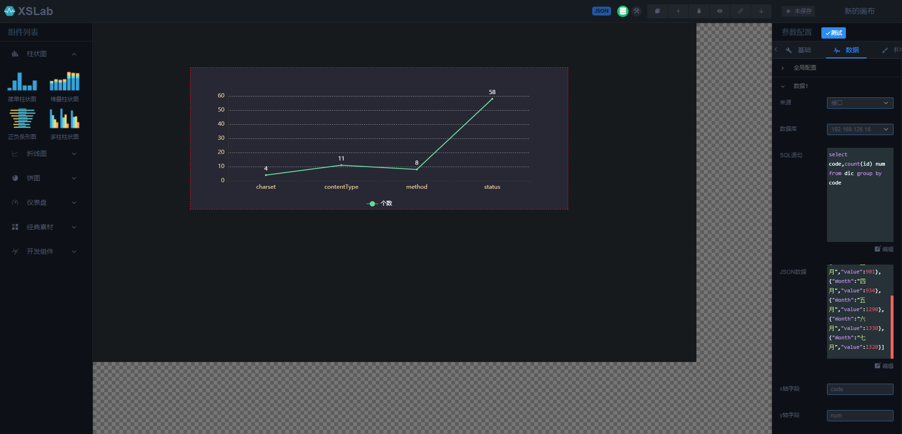

# 可视化图表编辑器
> 可视化图表编辑器，包含绘制图表、绑定数据源、在线预览、导出图表、自定义开发等功能。

[在线DEMO](http://app.xdo.icu:3013/#/)

## 系统界面

1. 数据源配置

2. 绘制图表

3. 预览

4. 查看配置JSON

5. 导出画布

## 安装

1. 下载release包
2. 启动后端程序`cd xslab-rearend && npm install && node index.js`
3. 修改编辑器`xslab-editor`的配置文件`config.json`，其中`baseUrl`改为实际后端地址，比如：`http://x.x.x.x:11525`
4. 访问系统，`http://x.x.x.x/xslab-editor`

## 支持

您的支持，是我前进的动力！

